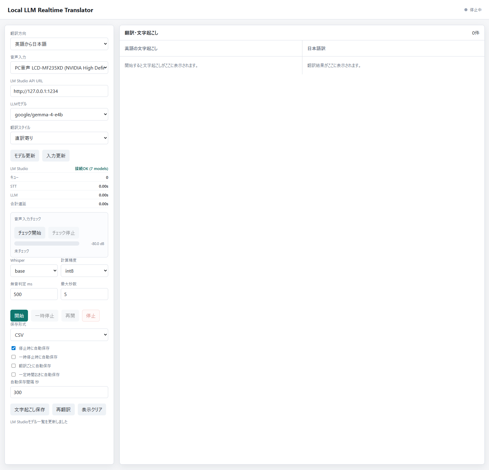

# Local LLM Realtime Translator

PC内部音声またはマイク音声をWhisperで文字起こしし、LM StudioのローカルLLMで日本語/英語へリアルタイム翻訳するローカルWebアプリです。

```text
PC内部音声 / マイク
  -> WebRTC VADで発話区切り
  -> faster-whisperで文字起こし
  -> LM Studio OpenAI互換APIで翻訳
  -> ブラウザ画面に文字起こしと翻訳を表示
```

## できること

- ブラウザをGUIとして利用
- PC内部音声用の仮想/ループバック入力、または通常マイクを選択
- NVIDIA High Definition AudioなどのWASAPI出力をPC音声ループバックとして選択
- 入力デバイスを `PC音声 / ループバック` と `マイク / 入力デバイス` に分類表示
- 音声入力チェックで入力レベルをメーター表示
- LM Studioの接続状態を画面上に表示
- 音声キュー、STT、LLM、合計遅延の処理メトリクスを表示
- キュー満杯時に調整案を表示
- LM Studioのモデル一覧を取得して選択
- 英語から日本語、日本語から英語を選択
- 翻訳スタイルを選択
- 文字起こしと翻訳を左右にリアルタイム表示
- 文字起こしと翻訳の対応行がずれないペア表示
- 表示エリア内で自動スクロール
- 文字起こし済みテキストを再翻訳
- TXT、HTML、Markdown、JSONL、CSV形式で保存
- 停止時、一時停止時、一定時間おき、翻訳ごとの自動保存をON/OFF
- 音声入力の一時停止と再開
- 前回のUI設定をブラウザに保存して復元
- 確認付きの表示クリア
- 文字起こしと翻訳結果を `transcripts/` に保存

## 必要なもの

- Python 3.10+
- このプロジェクト用の仮想環境 `.venv`
- LM Studio
- LM Studioで読み込んだチャット/指示追従モデル
- PC内部音声を直接取り込む場合は、OS側で入力デバイスとして見えるループバック/仮想オーディオ
  - Windows: VB-CABLE、SteelSeries Sonar、OBS仮想オーディオなど
  - macOS: BlackHole 2ch など
  - Linux: PulseAudio/PipeWire monitor source など

## セットアップ

```powershell
python -m venv .venv
.\.venv\Scripts\python.exe -m pip install -r requirements.txt
```

LM Studio側でモデルを読み込み、Local Serverを開始してください。既定URLは次です。

```text
http://127.0.0.1:1234
```

アプリ内部では必要に応じて `/v1` を付けて、LM StudioのOpenAI互換APIへアクセスします。

## 起動

PowerShell:

```powershell
.\run_web.ps1
```

ポートを変える場合:

```powershell
.\run_web.ps1 --port 7861
```

直接起動する場合も、必ず `.venv` のPythonを使ってください。

```powershell
.\.venv\Scripts\python.exe web_translator.py
```

ブラウザで開きます。

```text
http://127.0.0.1:7860
```

Linux/macOS/Git Bash:

```bash
./run_web.sh
./run_web.sh --port 7861
```

## 使い方

1. `翻訳方向` を選択します。
2. `音声入力` でマイクまたはPC内部音声の入力デバイスを選択します。
3. `LM Studio API URL` が `http://127.0.0.1:1234` になっていることを確認します。
4. `モデル更新` を押してLM Studioのモデルを読み込み、`LLMモデル` を選択します。
5. 必要なら `翻訳スタイル` を選びます。
6. 必要なら `チェック開始` を押して、選択した音声入力に音が入っているか確認します。
7. `開始` を押します。
8. 文字起こしは左、翻訳は右に表示されます。
9. 新しい文字起こしと翻訳が追加されると、表示枠の中で自動的に下へスクロールします。
10. 必要に応じて `一時停止` / `再開` を使います。
11. モデルや翻訳スタイルを変えたあと、既存の文字起こしを翻訳し直す場合は `再翻訳` を押します。
12. 表示を消したい場合は `表示クリア` を押します。確認メッセージでOKした場合だけクリアされます。
13. 保存形式を選び、必要に応じて `文字起こし保存` を押します。HTMLを選ぶとブラウザで開けるレポート形式で保存されます。
14. 自動保存したい場合は、`停止時に自動保存`、`一時停止時に自動保存`、`翻訳ごとに自動保存`、`一定時間おきに自動保存` から必要なものをONにします。一定時間おきの場合は保存間隔も指定します。

サンプル


## PC内部音声の入力例

VB-CABLEを使う場合:

- Windows/Chromeの出力先: `CABLE Input (VB-Audio Virtual Cable)`
- このアプリの入力先: `CABLE Output (VB-Audio Virtual Cable)`

この環境の例では、PC内部音声の入力候補は `#33 CABLE Output (VB-Audio Virtual Cable), Windows WASAPI` です。

Windowsの通常出力を直接拾う場合は、音声入力の先頭付近に出る `PC音声 ... (loopback)` を選択します。たとえばChromeの出力先がNVIDIA HDMI/Display Audioの場合は、`PC音声 モニター名 (NVIDIA High Definition Audio) (loopback)` を試してください。

## 補足

- PCスピーカー音声を直接取りたい場合、通常マイクではなく、VB-CABLEなどの仮想入力デバイスを選択してください。
- faster-whisperのモデルは初回実行時にダウンロードされます。
- Hugging Faceのsymlink警告はWindowsのキャッシュ方式に関する警告で、動作自体は続行できます。
- LM StudioのLocal Serverが停止している、またはモデルが読み込まれていない場合、モデル一覧取得や翻訳に失敗します。
